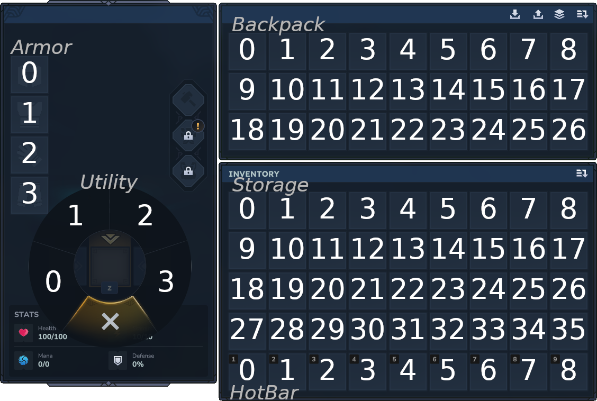

# Player format

**players/<uuid\>.json** files are used to store the state of individual players. The players UUID is the name of the file. These files are in [JSON format](https://www.json.org/json-en.html).

## JSON format

Show

* : Root object.
{.addicon .json.object}
    * Components:
    {.addicon .json.object}
        * Nameplate:
        {.addicon .json.object}
            * Text: The players name.
            {.addicon .json.string}
        * EffectController:
        {.addicon .json.object}
        * ObjectiveHistory:
        {.addicon .json.object}
            * ObjectiveHistory:
            {.addicon .json.object}
            * ObjectiveLineHistory:
            {.addicon .json.object}
        * DisplayName:
        {.addicon .json.object}
            * DisplayName:
            {.addicon .json.object}
                * RawText: The players name.
                {.addicon .json.string}
                * Bold:
                {.addicon .json.boolean}
                * Italic:
                {.addicon .json.boolean}
                * Monospace:
                {.addicon .json.boolean}
                * Underline:
                {.addicon .json.boolean}
        * UIComponentList:
        {.addicon .json.object}
        * Transform:
        {.addicon .json.object}
            * Position:
            {.addicon .json.object}
                * X:
                {.addicon .json.float}
                * Y:
                {.addicon .json.float}
                * Z:
                {.addicon .json.float}
            * Rotation:
            {.addicon .json.object}
                * Pitch:
                {.addicon .json.float}
                * Yaw:
                {.addicon .json.float}
                * Roll:
                {.addicon .json.float}
        * BuilderTools:
        {.addicon .json.object}
            * SelectionHistory:
        * Velocity:
        {.addicon .json.object}
            * Velocity:
            {.addicon .json.object}
                * X:
                {.addicon .json.float}
                * Y:
                {.addicon .json.float}
                * Z:
                {.addicon .json.float}
        * Player
        {.addicon .json.object}
            * Version:
            {.addicon .json.int}
            * UUID:
            {.addicon .json.object}
                * $binary:
                {.addicon .json.string}
                * $type:
                {.addicon .json.string}
            * Inventory:
            {.addicon .json.object}
                * Version:
                {.addicon .json.int}
                * Storage:
                {.addicon .json.object}
                    * Id:
                    {.addicon .json.string}
                    * Capacity:
                    {.addicon .json.int}
                    * Items:
                    {.addicon .json.object}
                        * <#\>:
                        {.addicon .json.object}
                            * Id:
                            {.addicon .json.string}
                            * Quantity:
                            {.addicon .json.int}
                            * Durability:
                            {.addicon .json.float}
                            * MaxDurability:
                            {.addicon .json.float}
                            * OverrideDropItemAnimation:
                            {.addicon .json.boolean}
                * Armor:
                {.addicon .json.object}
                    * Id:
                    {.addicon .json.string}
                    * Capacity:
                    {.addicon .json.int}
                    * Items:
                    {.addicon .json.object}
                        * <#\>:
                        {.addicon .json.object}
                            * Id:
                            {.addicon .json.string}
                            * Quantity:
                            {.addicon .json.int}
                            * Durability:
                            {.addicon .json.float}
                            * MaxDurability:
                            {.addicon .json.float}
                            * OverrideDropItemAnimation:
                            {.addicon .json.boolean}
                * HotBar:
                {.addicon .json.object}
                    * Id:
                    {.addicon .json.string}
                    * Capacity:
                    {.addicon .json.int}
                    * Items:
                    {.addicon .json.object}
                        * <#\>:
                        {.addicon .json.object}
                            * Id:
                            {.addicon .json.string}
                            * Quantity:
                            {.addicon .json.int}
                            * Durability:
                            {.addicon .json.float}
                            * MaxDurability:
                            {.addicon .json.float}
                            * OverrideDropItemAnimation:
                            {.addicon .json.boolean}
                * Utility:
                {.addicon .json.object}
                    * Id:
                    {.addicon .json.string}
                    * Capacity:
                    {.addicon .json.int}
                    * Items:
                    {.addicon .json.object}
                        * <#\>:
                        {.addicon .json.object}
                            * Id:
                            {.addicon .json.string}
                            * Quantity:
                            {.addicon .json.int}
                            * Durability:
                            {.addicon .json.float}
                            * MaxDurability:
                            {.addicon .json.float}
                            * OverrideDropItemAnimation:
                            {.addicon .json.boolean}
                * Backpack:
                {.addicon .json.object}
                    * Id:
                    {.addicon .json.string}
                    * Capacity:
                    {.addicon .json.int}
                    * Items:
                    {.addicon .json.object}
                        * <#\>:
                        {.addicon .json.object}
                            * Id:
                            {.addicon .json.string}
                            * Quantity:
                            {.addicon .json.int}
                            * Durability:
                            {.addicon .json.float}
                            * MaxDurability:
                            {.addicon .json.float}
                            * OverrideDropItemAnimation:
                            {.addicon .json.boolean}
                * ActiveHotbarSlot:
                {.addicon .json.int}
                * Tool:
                {.addicon .json.object}
                    * Id:
                    {.addicon .json.string}
                    * Capacity:
                    {.addicon .json.int}
                    * Items:
                    {.addicon .json.object}
                        * <#\>:
                        {.addicon .json.object}
                            * Id:
                            {.addicon .json.string}
                            * Quantity:
                            {.addicon .json.int}
                            * Durability:
                            {.addicon .json.float}
                            * MaxDurability:
                            {.addicon .json.float}
                            * OverrideDropItemAnimation:
                            {.addicon .json.boolean}
                * ActiveToolsSlot:
                {.addicon .json.int}
                * ActiveUtilitySlot:
                {.addicon .json.int}
                * SortType:
                {.addicon .json.string}
            * PlayerData:
            {.addicon .json.object}
                * BlockIdVersion:
                {.addicon .json.int}
                * World:
                {.addicon .json.string}
                * KnownRecipes:
                {.addicon .json.array}
                * PerWorldData:
                {.addicon .json.object}
                    * instance-<Zone_Name\>-<uuid\>:
                    {.addicon .json.object}
                        * LastPosition:
                        {.addicon .json.object}
                            * X:
                            {.addicon .json.float}
                            * Y:
                            {.addicon .json.float}
                            * Z:
                            {.addicon .json.float}
                            * Pitch:
                            {.addicon .json.float}
                            * Yaw:
                            {.addicon .json.float}
                            * Roll:
                            {.addicon .json.float}
                        * LastMovementStates:
                        {.addicon .json.object}
                            * Flying:
                            {.addicon .json.boolean}
                        * FirstSpawn:
                        {.addicon .json.boolean}
                        * DeathPositions:
                        {.addicon .json.array}
                            * : A death position.
                            {.addicon .json.object}
                                * MarkerId:
                                {.addicon .json.string}
                                * Transform:
                                {.addicon .json.object}
                                    * X:
                                    {.addicon .json.float}
                                    * Y:
                                    {.addicon .json.float}
                                    * Z:
                                    {.addicon .json.float}
                                    * Pitch:
                                    {.addicon .json.float}
                                    * Yaw:
                                    {.addicon .json.float}
                                    * Roll:
                                    {.addicon .json.float}
                                * Day:
                                {.addicon .json.int}
                * DiscoveredZones:
                {.addicon .json.array}
                    * : A zone the player has discoverd.
                    {.addicon .json.string}
                * DiscoveredInstances:
                {.addicon .json.array}
                    * : A discovered instance.
                    {.addicon .json.object}
                        * $binary:
                        {.addicon .json.string}
                        * $type:
                        {.addicon .json.string}
                * ReputationData:
                {.addicon .json.object}
                * ActiveObjectiveUUIDs:
                {.addicon .json.array}
            * BlockPlacementOverride:
            {.addicon .json.boolean}
            * HotbarManager:
            {.addicon .json.object}
                * SavedHotbars:
                {.addicon .json.array}
                    * : A saved hotbar row.
                    {.addicon .json.object}
                        * Id:
                        {.addicon .json.string}
                        * Capacity:
                        {.addicon .json.int}
                        * Items:
                        {.addicon .json.object}
                            * <#\>:
                            {.addicon .json.object}
                                * Id:
                                {.addicon .json.string}
                                * Quantity:
                                {.addicon .json.int}
                                * Durability:
                                {.addicon .json.float}
                                * MaxDurability:
                                {.addicon .json.float}
                                * OverrideDropItemAnimation:
                                {.addicon .json.boolean}
                * CurrentHotbar:
                {.addicon .json.int}
            * GameMode:
            {.addicon .json.string}
        * Invulnerable:
        {.addicon .json.object}
        * HitboxCollision:
        {.addicon .json.object}
            * HitboxCollisionConfigIndex:
            {.addicon .json.int}
        * UniqueItemUsages:
        {.addicon .json.object}
            * UniqueItemUsed:
            {.addicon .json.array}
        * Instance:
        {.addicon .json.object}
        * UUID:
        {.addicon .json.object}
            * UUID:
            {.addicon .json.object}
                * $binary:
                {.addicon .json.string}
                * $type:
                {.addicon .json.string}
        * EntityStates:
        {.addicon .json.object}
            * Version:
            {.addicon .json.int}
            * Stats:
            {.addicon .json.object}
                * <stat\>:
                {.addicon .json.object}
                    * Id:
                    {.addicon .json.string}
                    * Value:
                    {.addicon .json.float}
        * CreativeHub:
        {.addicon .json.object}
            * ParentHubWorldUuid:
            {.addicon .json.string}
        * HeadRotation:
        {.addicon .json.object}
            * Rotation:
            {.addicon .json.object}
                * Pitch:
                {.addicon .json.float}
                * Yaw:
                {.addicon .json.float}
                * Roll:
                {.addicon .json.float}

## Inventory slot numbers

The image below shows the slot numbers of the player's inventory slots as of Hytale 2026.01.13-dcad8778f.

The gray names reflect what each inventory section is called in the json.

## History

<table id="table">
    <tbody>
        <tr>
            <th colspan="8">
Early Access
</th>
        </tr>
        <tr>
            <th>2026.01.13-dcad8778f</th>
            <td>The player format is introduced.</td>
        </tr>
    </tbody>
</table>
