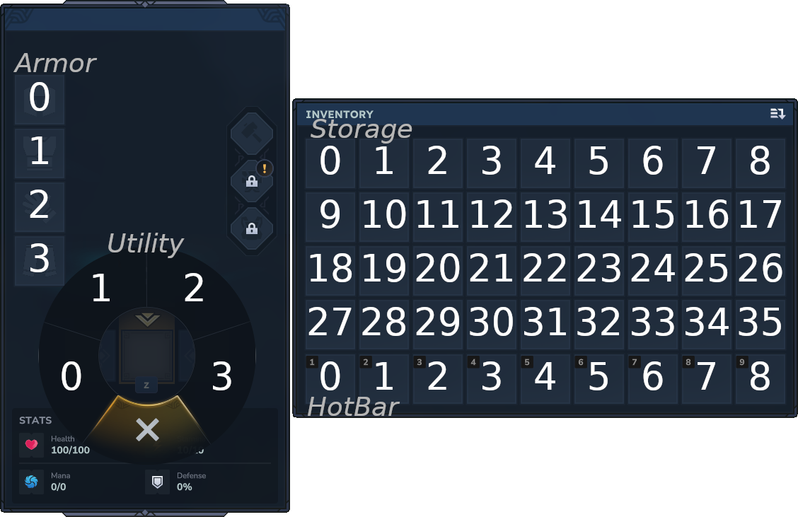

# Player format

**players/<uuid\>.json** files are used to store the state of individual players. The players UUID is the name of the file. These files are in [JSON format](https://www.json.org/json-en.html).

## JSON format

* : Root object.
{.addicon .json.object}
    * Components: All the components this player has.
    {.addicon .json.object}
        * Nameplate: The players unmodified name.
        {.addicon .json.object}
            * Text: The players name.
            {.addicon .json.string}
        * EffectController: Currently unknown.
        {.addicon .json.object}
        * ObjectiveHistory: Currently unknown.
        {.addicon .json.object}
            * ObjectiveHistory: Currently unknown.
            {.addicon .json.object}
            * ObjectiveLineHistory: Currently unknown.
            {.addicon .json.object}
        * DisplayName: The players display name information.
        {.addicon .json.object}
            * DisplayName
            {.addicon .json.object}
                * RawText: The players display name.
                {.addicon .json.string}
                * Bold: `true` if the name should be displayed in a bold font.
                {.addicon .json.boolean}
                * Italic: `true` if the name should be displayed in a italic font.
                {.addicon .json.boolean}
                * Monospace: `true` if the name should be displayed in a monospace font.
                {.addicon .json.boolean}
                * Underline: `true` if the name should be displayed with an underline.
                {.addicon .json.boolean}
        * UIComponentList: Currently unknown.
        {.addicon .json.object}
        * Transform: The players position and rotation in the world.
        {.addicon .json.object}
            * Position: The players position.
            {.addicon .json.object}
                * X: X position of the player.
                {.addicon .json.float}
                * Y: Y position of the player.
                {.addicon .json.float}
                * Z: Z position of the player.
                {.addicon .json.float}
            * Rotation: The players rotation.
            {.addicon .json.object}
                * Pitch: The X rotation of the player.
                {.addicon .json.float}
                * Yaw: The Y rotation of the player.
                {.addicon .json.float}
                * Roll: The Z rotation of the player.
                {.addicon .json.float}
        * BuilderTools: Currently unknown.
        {.addicon .json.object}
            * SelectionHistory: Currently unknown.
            {.addicon .json.boolean}
        * Velocity: The players velocity.
        {.addicon .json.object}
            * Velocity
            {.addicon .json.object}
                * X: X direction velocity value.
                {.addicon .json.float}
                * Y: Y direction velocity value.
                {.addicon .json.float}
                * Z: Z direction velocity value.
                {.addicon .json.float}
        * Player: Contains common player data.
        {.addicon .json.object}
            * Version: The player format version used when saved.
            {.addicon .json.int}
            * UUID: The players UUID stored in binary form encoded in base64.
            {.addicon .json.object}
                * $binary: The base64 encoded binary UUID value.
                {.addicon .json.string}
                * $type: The BSON binary type. Always `04` for UUID.
                {.addicon .json.string}
            * Inventory: Contains all items across all inventories for this player.
            {.addicon .json.object}
                * Version: The inventory format version used when saved.
                {.addicon .json.int}
                * Storage: Contains all items in the main inventory.
                {.addicon .json.object}
                    * Id: The inventory type id. Normally `Simple`.
                    {.addicon .json.string}
                    * Capacity: The total number of inventory slots available.
                    {.addicon .json.int}
                    * Items: List of items in this inventory. Empty if no items are present.
                    {.addicon .json.object}
                        * <#\>: An item at the given inventory index.
                        {.addicon .json.object}
                            * Id: The item id.
                            {.addicon .json.string}
                            * Quantity: The item count.
                            {.addicon .json.int}
                            * Durability: The items current durability.
                            {.addicon .json.float}
                            * MaxDurability: The items total durability when un-damaged.
                            {.addicon .json.float}
                            * OverrideDropItemAnimation: Currently unknown.
                            {.addicon .json.boolean}
                * Armor: Contains all items in the armor slots.
                {.addicon .json.object}
                    * Id: The inventory type id. Normally `Simple`.
                    {.addicon .json.string}
                    * Capacity: The total number of inventory slots available.
                    {.addicon .json.int}
                    * Items: List of items in this inventory. Empty if no items are present.
                    {.addicon .json.object}
                        * <#\>: An item at the given inventory index.
                        {.addicon .json.object}
                            * Id: The item id.
                            {.addicon .json.string}
                            * Quantity: The item count.
                            {.addicon .json.int}
                            * Durability: The items current durability.
                            {.addicon .json.float}
                            * MaxDurability: The items total durability when un-damaged.
                            {.addicon .json.float}
                            * OverrideDropItemAnimation: Currently unknown.
                            {.addicon .json.boolean}
                * HotBar: Contains all items in the hotbar.
                {.addicon .json.object}
                    * Id: The inventory type id. Normally `Simple`.
                    {.addicon .json.string}
                    * Capacity: The total number of inventory slots available.
                    {.addicon .json.int}
                    * Items: List of items in this inventory. Empty if no items are present.
                    {.addicon .json.object}
                        * <#\>: An item at the given inventory index.
                        {.addicon .json.object}
                            * Id: The item id.
                            {.addicon .json.string}
                            * Quantity: The item count.
                            {.addicon .json.int}
                            * Durability: The items current durability.
                            {.addicon .json.float}
                            * MaxDurability: The items total durability when un-damaged.
                            {.addicon .json.float}
                            * OverrideDropItemAnimation: Currently unknown.
                            {.addicon .json.boolean}
                * Utility: Contains all items in the utility/offhand wheel.
                {.addicon .json.object}
                    * Id: The inventory type id. Normally `Simple`.
                    {.addicon .json.string}
                    * Capacity: The total number of inventory slots available.
                    {.addicon .json.int}
                    * Items: List of items in this inventory. Empty if no items are present.
                    {.addicon .json.object}
                        * <#\>: An item at the given inventory index.
                        {.addicon .json.object}
                            * Id: The item id.
                            {.addicon .json.string}
                            * Quantity: The item count.
                            {.addicon .json.int}
                            * Durability: The items current durability.
                            {.addicon .json.float}
                            * MaxDurability: The items total durability when un-damaged.
                            {.addicon .json.float}
                            * OverrideDropItemAnimation: Currently unknown.
                            {.addicon .json.boolean}
                * Backpack: Contains all items in the entity's backpack.
                {.addicon .json.object}
                    * Id: The inventory type id. Normally `Simple`.
                    {.addicon .json.string}
                    * Capacity: The total number of inventory slots available.
                    {.addicon .json.int}
                    * Items: List of items in this inventory. Empty if no items are present.
                    {.addicon .json.object}
                        * <#\>: An item at the given inventory index.
                        {.addicon .json.object}
                            * Id: The item id.
                            {.addicon .json.string}
                            * Quantity: The item count.
                            {.addicon .json.int}
                            * Durability: The items current durability.
                            {.addicon .json.float}
                            * MaxDurability: The items total durability when un-damaged.
                            {.addicon .json.float}
                            * OverrideDropItemAnimation: Currently unknown.
                            {.addicon .json.boolean}
                * ActiveHotbarSlot: The entity's currently selected hotbar slot.
                {.addicon .json.int}
                * Tool: Currently unknown.
                {.addicon .json.object}
                    * Id: The inventory type id. Normally `Simple`.
                    {.addicon .json.string}
                    * Capacity: The total number of inventory slots available.
                    {.addicon .json.int}
                    * Items: List of items in this inventory. Empty if no items are present.
                    {.addicon .json.object}
                        * <#\>: An item at the given inventory index.
                        {.addicon .json.object}
                            * Id: The item id.
                            {.addicon .json.string}
                            * Quantity: The item count.
                            {.addicon .json.int}
                            * Durability: The items current durability.
                            {.addicon .json.float}
                            * MaxDurability: The items total durability when un-damaged.
                            {.addicon .json.float}
                            * OverrideDropItemAnimation: Currently unknown.
                            {.addicon .json.boolean}
                * ActiveToolsSlot: The entity's currently selected tool slot. `-1` if none.
                {.addicon .json.int}
                * ActiveUtilitySlot: The entity's currently selected utility/offhand slot.
                {.addicon .json.int}
                * SortType: The entity's inventory item sort type.
                {.addicon .json.string}
            * PlayerData:
            {.addicon .json.object}
                * BlockIdVersion: The block id version at the time of saving.
                {.addicon .json.int}
                * World: The current world/universe the player is in.
                {.addicon .json.string}
                * KnownRecipes: Currently unknown.
                {.addicon .json.array}
                * PerWorldData: Contains per world information for this player.
                {.addicon .json.object}
                    * <instanceName\>: Contains this players per world data for this world.
                    {.addicon .json.object}
                        * LastPosition: The players last position and rotation in this world.
                        {.addicon .json.object}
                            * X: The players X position of where they last were in this world.
                            {.addicon .json.float}
                            * Y: The players Y position of where they last were in this world.
                            {.addicon .json.float}
                            * Z: The players Z position of where they last were in this world.
                            {.addicon .json.float}
                            * Pitch: The players X rotation of where they were last looking in this world.
                            {.addicon .json.float}
                            * Yaw: The players Y rotation of where they were last looking in this world.
                            {.addicon .json.float}
                            * Roll: The players Z rotation of where they were last looking in this world.
                            {.addicon .json.float}
                        * LastMovementStates: The players last movement state.
                        {.addicon .json.object}
                            * Flying: `true` if the player was flying when they were last in this world.
                            {.addicon .json.boolean}
                        * FirstSpawn: Currently unknown.
                        {.addicon .json.boolean}
                        * RespawnPoints: List of all respawn points for this player.
                        {.addicon .json.array}
                            * : A respawn point.
                            {.addicon .json.object}
                                * BlockPosition:
                                {.addicon .json.object}
                                    * X: X position of the respawn block.
                                    {.addicon .json.int}
                                    * Y: Y position of the respawn block.
                                    {.addicon .json.int}
                                    * Z: Z position of the respawn block.
                                    {.addicon .json.int}
                                * RespawnPosition:
                                    * X: X position of where the player respawns at this location.
                                    {.addicon .json.float}
                                    * Y: Y position of where the player respawns at this location.
                                    {.addicon .json.float}
                                    * Z: Z position of where the player respawns at this location.
                                    {.addicon .json.float}
                                * Name: The name of this respawn location.
                                {.addicon .json.string}
                        * DeathPositions: Contains all the players death map markers.
                        {.addicon .json.array}
                            * : A death position.
                            {.addicon .json.object}
                                * MarkerId: The death markers id. Has the format of `death-marker-<uuid>`
                                {.addicon .json.string}
                                * Transform: The position and rotation information of where the player died.
                                {.addicon .json.object}
                                    * X: The X position of where the player died.
                                    {.addicon .json.float}
                                    * Y: The Y position of where the player died.
                                    {.addicon .json.float}
                                    * Z: The Z position of where the player died.
                                    {.addicon .json.float}
                                    * Pitch: The X rotation of the player when they died. (Unused in practice. Always `0.0`)
                                    {.addicon .json.float}
                                    * Yaw: The Y rotation of the player when they died. (Unused in practice. Always `0.0`)
                                    {.addicon .json.float}
                                    * Roll: The Z rotation of the player when they died. (Unused in practice. Always `0.0`)
                                    {.addicon .json.float}
                                * Day: The day number that the player died on.
                                {.addicon .json.int}
                        * UserMarkers: Contains all player made map markers that aren't shared with other players.
                        {.addicon .json.array}
                            * : A custom map marker.
                            {.addicon .json.object}
                                * Id: The id of this marker. Has the format of `user_personal_<uuid>`.
                                {.addicon .json.string}
                                * X: The X position of this map marker.
                                {.addicon .json.float}
                                * Z: The Z position of this map marker.
                                {.addicon .json.float}
                                * Name: The name of this map marker.
                                {.addicon .json.string}
                                * Icon: The icon file name for this map marker.
                                {.addicon .json.string}
                                * ColorTint: The hex tint color to apply to the marker icon.
                                {.addicon .json.string}
                                * CreatedByUuid: The UUID of the player who created this map marker stored in binary form encoded in base64.
                                {.addicon .json.object}
                                    * $binary: The base64 encoded binary UUID value.
                                    {.addicon .json.string}
                                    * $type: The BSON binary type. Always `04` for UUID.
                                    {.addicon .json.string}
                                * CreatedByName: The name of the player who created this map marker.
                                {.addicon .json.string}
                * DiscoveredZones: Contains all the zones the player has discovered.
                {.addicon .json.array}
                    * : A zone the player has discoverd.
                    {.addicon .json.string}
                * DiscoveredInstances: Contains the UUIDs of all instances this player discovered.
                {.addicon .json.array}
                    * : A discovered instance.
                    {.addicon .json.object}
                        * $binary: The discovered instances base64 encoded binary UUID value.
                        {.addicon .json.string}
                        * $type: The BSON binary type. Always `04` for UUID.
                        {.addicon .json.string}
                * ReputationData: Currently unknown.
                {.addicon .json.object}
                * ActiveObjectiveUUIDs: Currently unknown.
                {.addicon .json.array}
            * BlockPlacementOverride: Currently unknown.
            {.addicon .json.boolean}
            * HotbarManager: Contains the players saved hotbar information.
            {.addicon .json.object}
                * SavedHotbars: Contains all the players saved hotbars.
                {.addicon .json.array}
                    * : A saved hotbar row. `null` if this row is empty.
                    {.addicon .json.object}
                        * Id: The inventory type id. Normally `Simple`.
                        {.addicon .json.string}
                        * Capacity: The total number of inventory slots available.
                        {.addicon .json.int}
                        * Items: List of items in this inventory. Empty if no items are present.
                        {.addicon .json.object}
                            * <#\>: An item at the given inventory index.
                            {.addicon .json.object}
                                * Id: The item id.
                                {.addicon .json.string}
                                * Quantity: The item count.
                                {.addicon .json.int}
                                * Durability: The items current durability.
                                {.addicon .json.float}
                                * MaxDurability: The items total durability when un-damaged.
                                {.addicon .json.float}
                                * OverrideDropItemAnimation: Currently unknown.
                                {.addicon .json.boolean}
                * CurrentHotbar: The currently loaded saved hotbar.
                {.addicon .json.int}
            * GameMode: This players current gamemode.
            {.addicon .json.string}
        * Invulnerable: if present the player is invulnerable.
        {.addicon .json.object}
        * HitboxCollision: Currently unknown.
        {.addicon .json.object}
            * HitboxCollisionConfigIndex: Currently unknown.
            {.addicon .json.int}
        * UniqueItemUsages: Tracks 1 time uses unique items that the player has used.
        {.addicon .json.object}
            * UniqueItemUsed: Contains all unique items this player has used.
            {.addicon .json.array}
                * : An unique item that this player has used.
                {.addicon .json.string}
        * Instance: Currently unknown.
        {.addicon .json.object}
        * UUID: The players UUID stored in binary form encoded in base64. (Again)
        {.addicon .json.object}
            * UUID
            {.addicon .json.object}
                * $binary: The base64 encoded binary UUID value.
                {.addicon .json.string}
                * $type: The BSON binary type. Always `04` for UUID.
                {.addicon .json.string}
        * EntityStats: Contains all stats of this player, such as their oxygen level, mana level, and more.
        {.addicon .json.object}
            * Version: The player stats format version used when saved.
            {.addicon .json.int}
            * Stats: Contains all stats of this player.
            {.addicon .json.object}
                * <stat\>: A player stat.
                {.addicon .json.object}
                    * Id: The id of the stat. Normally matches document key name.
                    {.addicon .json.string}
                    * Value: The value of the player stat.
                    {.addicon .json.float}
        * CreativeHub: Information for the Creative mode hub.
        {.addicon .json.object}
            * ParentHubWorldUuid: The stringified UUID of the creative world hub.
            {.addicon .json.string}
        * HeadRotation: The players initial head rotation.
        {.addicon .json.object}
            * Rotation
            {.addicon .json.object}
                * Pitch: The initial X rotation of the player.
                {.addicon .json.float}
                * Yaw: The initial Y rotation of the player.
                {.addicon .json.float}
                * Roll: The initial Z rotation of the player.
                {.addicon .json.float}

## Inventory slot numbers

The image below shows the slot numbers of the player's inventory slots as of Hytale 2026.01.13-dcad8778f.

The gray names reflect what each inventory section is called in the json.

## History

<table id="table">
    <tbody>
        <tr>
            <th colspan="8">
Early Access
</th>
        </tr>
        <tr>
            <th>2026.01.13-dcad8778f</th>
            <td>The player format is introduced.</td>
        </tr>
        <tr>
            <th>2026.02.17-255364b8e</th>
            <td>Added UserMarkers array to PerWorldData to store information for the new User-Placed Map Markers</td>
        </tr>
    </tbody>
</table>
